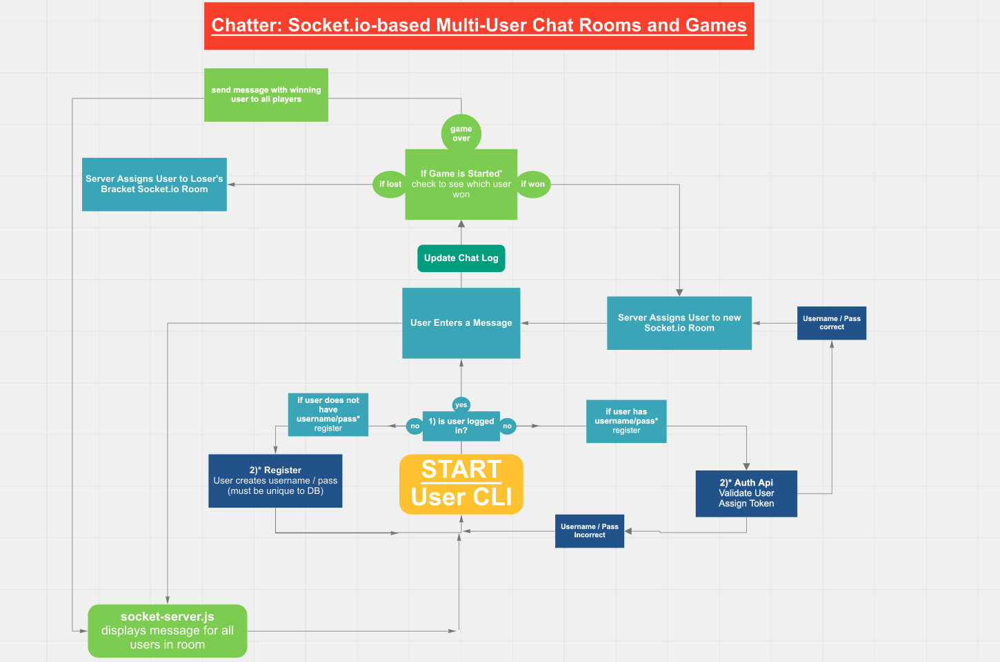
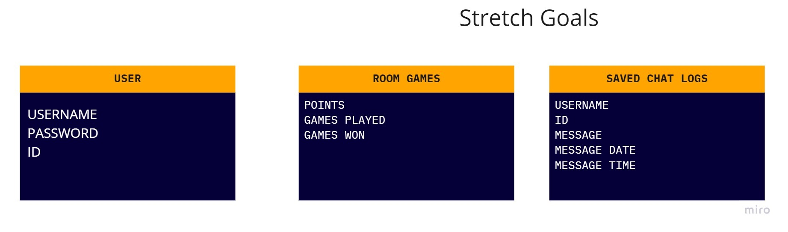

# chat-roulette

**Developers: Dar-Ci Calhoun, Cody Carpenter, Michael Greene, Anne Thorsteinson** 

## Structure of App 

**Chatter** will be an app where users log in and, once authenticated, they will be paired with another user in a chat room. After a set interval of time, the users will be cycled and paired with a new user in a new room. 

## Stretch Goals 

Gamify the chat rooms to add depth and interest to the project. 

node.js/socket.io/mongoDB app that allows users to sign up, login, and join chat rooms that cycle after a set time interval

